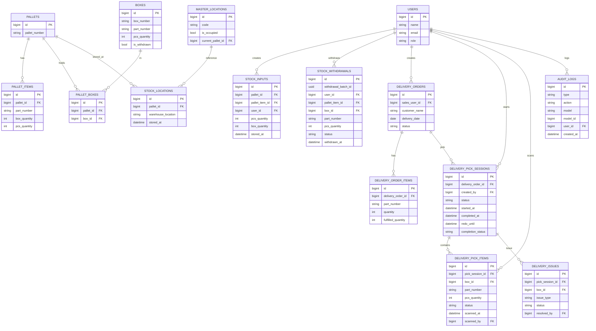

# Ringkasan Sistem

## 1) System Architecture Overview

- **Frontend**: Blade views (Bootstrap CDN + Tailwind via Vite).
- **Backend**: Laravel Controllers + Services + Models.
- **Database**: MySQL (relasi utama: pallet, box, stock, delivery, audit).
- **Integrasi**: Export PDF (DomPDF) & Excel (Maatwebsite).

```mermaid
flowchart TB
  subgraph UI[Frontend UI]
    VIEWS[Blade Views]
  end

  subgraph APP[Laravel Application]
    ROUTES[Routes]
    CTRL[Controllers]
    SRV[Services]
    MDL[Models]
  end

  subgraph DB[(MySQL Database)]
    TABLES[Tables]
  end

  VIEWS --> ROUTES --> CTRL --> SRV --> MDL --> DB
```

---

## 2) Database Design (ERD)



---

## 3) Master Data Tables

- `users` (role user)
- `master_locations` (kode lokasi)
- `part_settings` (qty_box default)

---

## 4) Inventory Tables

- `pallets`
- `pallet_items`
- `boxes`
- `pallet_boxes`
- `stock_locations`

---

## 5) Transaction Tables

- `stock_inputs`
- `stock_withdrawals`
- `delivery_orders`
- `delivery_order_items`
- `delivery_pick_sessions`
- `delivery_pick_items`
- `delivery_issues`

---

## 6) Audit & Logging Tables

- `audit_logs`

---

## 7) Business Flow Diagrams

### Inbound Flow (Stock Input)


### Outbound Flow (Withdrawal / Delivery)


---

## 8) Sales & PPC Approval Flow


---

## 9) RBAC (Role Based Access Control)

- **admin**: akses penuh.
- **admin_warehouse**: lokasi, part settings, scan issues, stock view.
- **warehouse_operator**: stock input, delivery fulfillment, merge pallet, stock view.
- **sales**: create & edit delivery order.
- **ppc**: approval delivery order.
- **supervisi**: reports & stock view.

Role enforcement utama ada di [routes/web.php](routes/web.php) dan controller terkait.

---

## 10) Backend API Structure

**Routing utama**: [routes/web.php](routes/web.php)

- **Auth**: /login, /logout
- **Stock Input**: /stock-input/\*
- **Delivery**: /delivery-stock/\*
- **Reports**: /reports/\*
- **Stock View API**:
    - /api/stock/by-part
    - /api/stock/part-detail/{partNumber}
    - /api/stock/pallet-detail/{palletId}
    - /api/locations/search

---

## 11) Frontend UI Structure

- Layout: resources/views/shared/layouts/app.blade.php
- Dashboard: resources/views/shared/dashboard.blade.php
- Stock Input: resources/views/warehouse/stock-input/\*
- Stock View: resources/views/shared/stock-view/\*
- Reports: resources/views/warehouse/reports/\*
- Delivery: resources/views/delivery/\*
- Master data: resources/views/admin/_, resources/views/users/_

---

## 12) Tech Stack

- **Backend**: Laravel 12, PHP 8.2
- **Database**: MySQL
- **Frontend**: Blade, Bootstrap CDN, Tailwind (Vite)
- **Export**: DomPDF, Maatwebsite Excel
- **Build tools**: Vite
